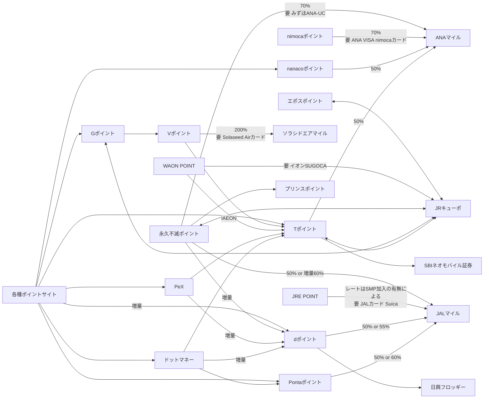

# point-flow

ポイント交換フローを書く

```mermaid
flowchart LR

各種ポイントサイト-->PeX
各種ポイントサイト-->ドットマネー
各種ポイントサイト-->Gポイント
各種ポイントサイト-->|増量|dポイント
各種ポイントサイト-->Pontaポイント
各種ポイントサイト-->Tポイント
各種ポイントサイト-->nanacoポイント

Vポイント-->|200%\n要 Solaseed Airカード|ソラシドエアマイル
Vポイント-->Tポイント
エポスポイント<-->JRキューポ
WAONP[WAON POINT]-->|要 イオンSUGOCA|JRキューポ
WAONP-->|iAEON|Tポイント
永久不滅ポイント<-->JRキューポ
永久不滅ポイント-->|50% or 増量60%|JALマイル
永久不滅ポイント-->|70%\n要 みずほANA-UC|ANAマイル
永久不滅ポイント-->|増量|dポイント
永久不滅ポイント-->プリンスポイント
JREP[JRE POINT]-->|レートはSMP加入の有無による\n要 JALカード Suica|JALマイル

PeX-->Tポイント
PeX-->|増量|dポイント
ドットマネー-->Tポイント
ドットマネー-->|増量|dポイント
ドットマネー-->Pontaポイント
Gポイント-->Vポイント
Gポイント<-->JRキューポ
nimocaポイント-->|70%\n要 ANA VISA nimocaカード|ANAマイル

nanacoポイント-->|50%|ANAマイル
Tポイント-->|50%|ANAマイル
Tポイント<-->JRキューポ
dポイント-->|50% or 55%|JALマイル
Pontaポイント-->|50% or 60%|JALマイル
dポイント-->日興フロッギー
Tポイント-->SBIネオモバイル証券
```
